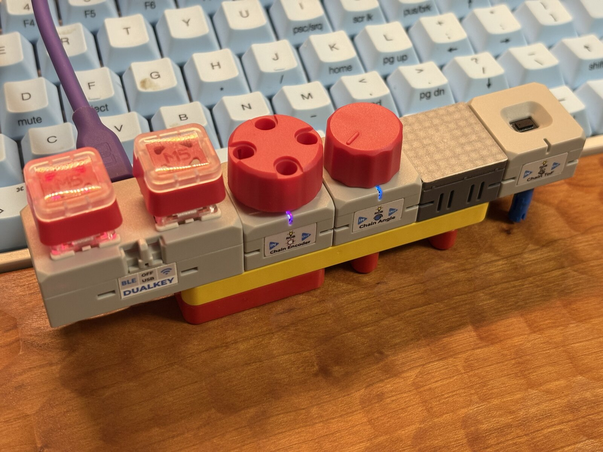
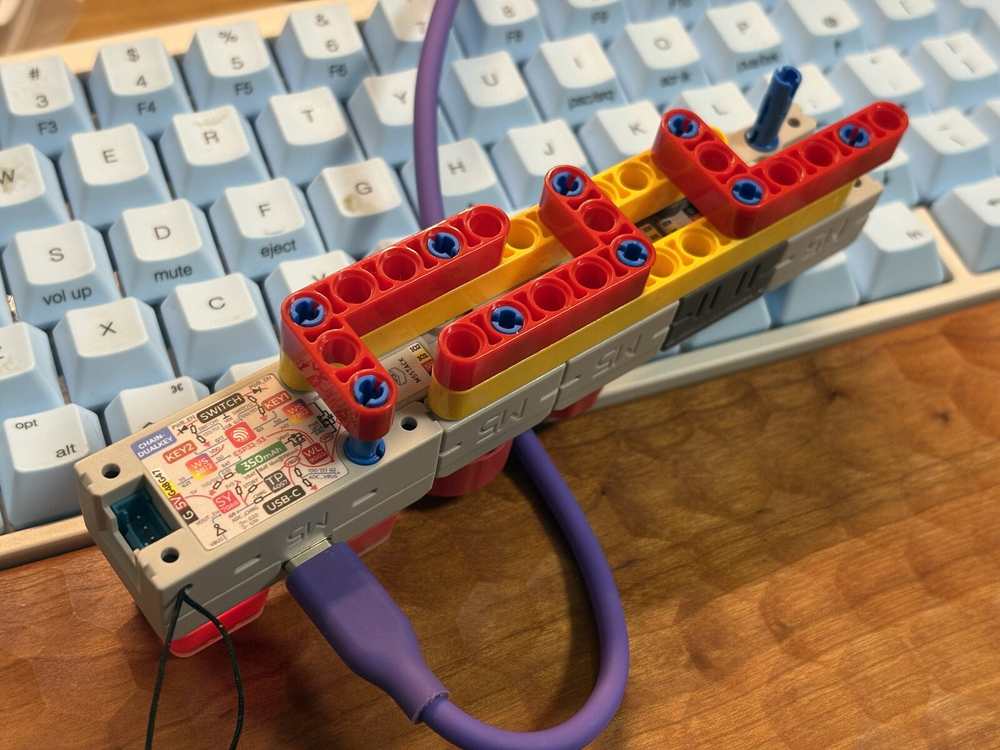

# M5DUALKEY-DeskCon-RGB-ToF

English: [README.md](README.md)

<p align="center">
  
</p>
<p align="center"><em>5モジュール構成のDeskConsole全景</em></p>

<p align="center">
  
</p>
<p align="center"><em>レゴテクニックによる固定構造を見せた裏面</em></p>

M5DUALKEY-DeskCon-RGB-ToFは、M5Stack Chain DualKey、Encoder、Angle、RGB、ToFで構成したmacOS向けのコンパクトなUSB HIDコントローラーです。

標準のキーボード、Consumer Control、マウスホイールイベントを送信します。DualKeyによるオーディオ出力選択と同時押しのカスタム操作はRaycast（または他のmacOS自動化ツール）へ委譲し、OS固有処理をファームウェアから分離しています。

## 主な特徴

- オーディオ出力の直接選択と、独立した同時押しカスタムショートカット
- ハードウェアによる音量・ミュート操作
- 起動時キャリブレーションとヒステリシスを備えたオートスクロール
- オーディオ出力とミュートを示す控えめなRGB状態表示
- ToFの連続距離で低輝度ambientを穏やかに変化させ、ToFからはHIDを送信しない設計
- 低輝度の8 x 8 ambient animationと操作別RGB feedback
- 4台のChainモジュールの自動探索と構成検証

## ハードウェア構成

本プロジェクトでは、USB-Cポートが背面に来る向きを正面として扱います。左右の表記はすべてこの向きから見たものです。正面から見て左から、DualKey、Encoder、Angle、Chain RGB、Chain ToFが固定の物理配置です。

```text
正面図（USB-Cは背面側）

+-----------+-----------+-----------+-----------+-----------+
| DualKey   | Encoder   | Angle     | RGB       | ToF       |
+-----------+-----------+-----------+-----------+-----------+
```

- M5Stack Chain DualKey
- M5Stack Chain Encoder
- M5Stack Chain Angle
- M5Stack Chain RGB
- M5Stack Chain ToF
- macOSへのUSB接続

## 簡易操作一覧

| モジュール | 操作 | 動作 |
| --- | --- | --- |
| DualKey | 左 | ORA4を選択（`Ctrl + Cmd + 1`）、LEDは赤 |
| DualKey | 右 | Studio Displayを選択（`Ctrl + Cmd + 2`）、LEDは黄 |
| DualKey | 左右同時 | カスタム操作（`Ctrl + Option + E`） |
| Encoder | 回転／押し込み | 音量アップ、音量ダウン、ミュート。Mute中は紫 |
| Angle | 左／中央／右 | 上スクロール、停止、下スクロール。操作中は青 |
| Chain ToF | 連続距離 | Matrix ambientの明るさ、呼吸、広がり、揺らぎを穏やかに変化。HID出力なし |
| Chain RGB | Matrix表示 | 距離に反応するambient glowとDualKey／Encoder／Angle操作のnon-blocking feedback |

DualKeyのキーボードショートカットはRaycastを使用します。Encoderの音量／ミュートとAngleのスクロールは、USB HIDイベントとしてmacOSへ直接送信されます。ToFからUSB HIDイベントは送信しません。

LEDはmacOSから取得した実状態ではなく、ファームウェア内の状態を表示します。起動時の挙動と制約は[操作とLED表示](docs/controls.ja.md)を参照してください。

## 詳細ドキュメント

- [アーキテクチャ](docs/architecture.ja.md)
- [操作とLED表示](docs/controls.ja.md)
- [Raycast連携](docs/raycast.ja.md)
- [開発環境とビルド設定](docs/development.ja.md)

## Project Status

USB HID Keyboard、Consumer Control、Angleオートスクロール、起動時キャリブレーション、ToF SINGLEによる連続proximity入力、RGB状態表示、non-blocking Matrix animationを実装済みです。Matrixのmaster brightnessは50%を絶対上限とし、全buffer転送は最大12.5 fpsに制限しています。BLE HIDは今後実装予定です。

## ライセンス

MIT License。詳細は[LICENSE](LICENSE)を参照してください。

## Maintainer

omiya-bonsai
